* Table of Contents
{:toc}

--------------------------------------------------------------------------------------------------------------------

## **Setting up, getting started**

Refer to the guide [_Setting up and getting started_](SettingUp.md).

--------------------------------------------------------------------------------------------------------------------

## **Design**

### Architecture

The ***Architecture Diagram*** given above explains the high-level design of the App. Given below is a quick overview of each component.

:bulb: **Tip:** The `.puml` files used to create diagrams in this document can be found in the [diagrams](https://github.com/se-edu/addressbook-level3/tree/master/docs/diagrams/) folder. Refer to the [_PlantUML Tutorial_ at se-edu/guides](https://se-education.org/guides/tutorials/plantUml.html) to learn how to create and edit diagrams.

The rest of the App consists of four components.

* [**`UI`**](#ui-component): The UI of the App.
* [**`Logic`**](#logic-component): The command executor.
* [**`Model`**](#model-component): Holds the data of the App in memory.
* [**`Storage`**](#storage-component): Reads data from, and writes data to, the hard disk.

Each of the four components,

* defines its *API* in an `interface` with the same name as the Component.
* exposes its functionality using a concrete `{Component Name}Manager` class (which implements the corresponding API `interface` mentioned in the previous point.

For example, the `Logic` component (see the class diagram given below) defines its API in the `Logic.java` interface and exposes its functionality using the `LogicManager.java` class which implements the `Logic` interface.

**How the architecture components interact with each other**

The *Sequence Diagram* below shows how the components interact with each other for the scenario where the user issues the command `delete 1`.

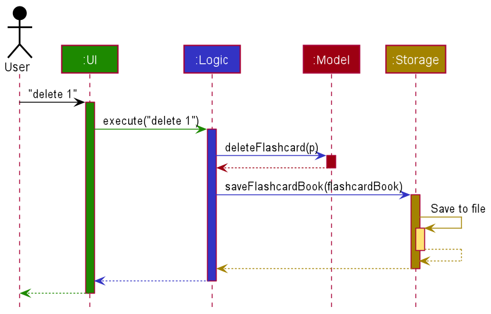

The *Sequence Diagram* below shows how the components interact with each other for the scenario where the user issues the command `start attempt`.

The sections below give more details of each component.

### UI component

**API** :
[`Ui.java`](https://github.com/se-edu/addressbook-level3/tree/master/src/main/java/seedu/definition/ui/Ui.java)

The UI consists of a `MainWindow` and `PerformanceWindow` that is made up of parts e.g.`CommandBox`, `ResultDisplay`, `FlashcardListPanel`, `StatusBarFooter` etc.
All these, including the `MainWindow`, inherit from the abstract `UiPart` class.

The `UI` component uses JavaFx UI framework. The layout of these UI parts are defined in matching `.fxml` files that are in the `src/main/resources/view` folder. For example, the layout of the [`MainWindow`](https://github.com/se-edu/addressbook-level3/tree/master/src/main/java/seedu/definition/ui/MainWindow.java) is specified in [`MainWindow.fxml`](https://github.com/se-edu/addressbook-level3/tree/master/src/main/resources/view/MainWindow.fxml)

The `UI` component,

* Executes user commands using the `Logic` component.
* Listens for changes to `Model` data so that the UI can be updated with the modified data.

### Logic component

**API** :
[`Logic.java`](https://github.com/se-edu/addressbook-level3/tree/master/src/main/java/seedu/definition/logic/Logic.java)

1. `Logic` uses the `FlashcardParser`, `QuizParser` and `PerformanceParser` classes to parse the user command
 depending on which mode the app is in.
1. `FlashcardParser` and `QuizParser` will result in a `Command` object while `PerformanceParser` will result in a
 `PerformanceCommand` object.
1. Either `Command` or `PerformanceCommand` objects are executed by the `LogicManager`.
1. The command execution can affect the `Model` (e.g. adding a flashcard).
1. The result of the command execution is encapsulated as a `CommandResult` or `PerformanceCommandResult` object for
 which is passed back to the `Ui`.
1. In addition, the `CommandResult` or `PerformanceCommandResult` object can also instruct the `Ui` to perform
 certain actions, such as displaying help to the user.

Given below is the Sequence Diagram for interactions within the `Logic` component for the `execute("delete 1")` API call.

:information_source: **Note:** The lifeline for `DeleteCommandParser` should end at the destroy marker (X) but due to a limitation of PlantUML, the lifeline reaches the end of diagram.

Given below is the Sequence Diagram for interactions within the `Logic` component for the `execute("start attempt")` API call.
The execution for the `end attempt` command is similar.

### Model component

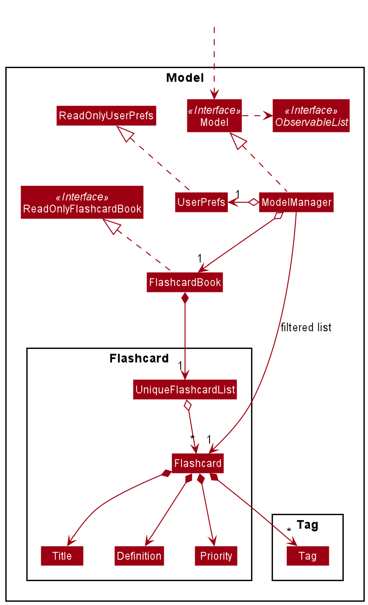

**API** : [`Model.java`](https://github.com/se-edu/addressbook-level3/tree/master/src/main/java/seedu/definition/model/Model.java)

The `Model`,

* stores a `UserPref` object that represents the user’s preferences.
* stores the definition book data.
* exposes an unmodifiable `ObservableList<Person>` that can be 'observed' e.g. the UI can be bound to this list so that the UI automatically updates when the data in the list change.
* does not depend on any of the other three components.

:information_source: **Note:** An alternative (arguably, a more OOP) model is given below. It has a `Tag` list in the `AddressBook`, which `Person` references. This allows `AddressBook` to only require one `Tag` object per unique `Tag`, instead of each `Person` needing their own `Tag` object. 
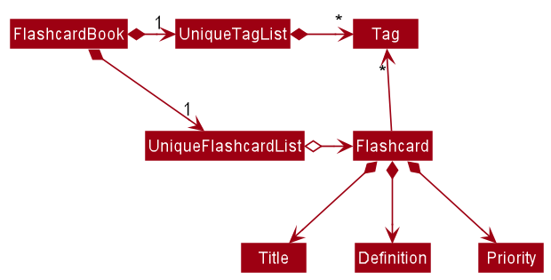

### Storage component

**API** : [`Storage.java`](https://github.com/se-edu/addressbook-level3/tree/master/src/main/java/seedu/definition/storage/Storage.java)

The `Storage` component,
* can save `UserPref` objects in json format and read it back.
* can save the flashcard book data in json format and read it back.

Additionally, the `Storage` component utilises a different mechanism for storing quiz performance data. The `Storage` component saves quiz performance data in text file format instead
of json format, and it reads it back using a separate set of classes. Hence, quiz performance data is stored and read separately from flashcard book data.

Within the `seedu.address.storage` package, there are several classes that are responsible for loading the performance of previous quiz attempts, and for saving the performance of current quiz attempts. The class diagram below
shows how these classes are related to one another.

Below are two sequence diagrams. The first sequence diagram shows the interactions between classes in the `seedu.address.storage` package when quiz performance data is read from
the text file and converted into a Performance object. The second sequence diagram shows the interactions between classes in the `seedu.address.storage` package when a Performance object
is converted to data that can be stored in the text file.

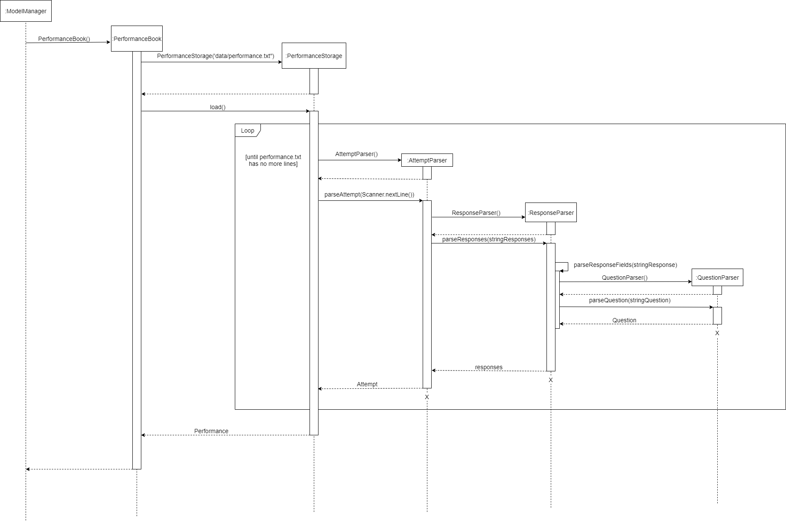

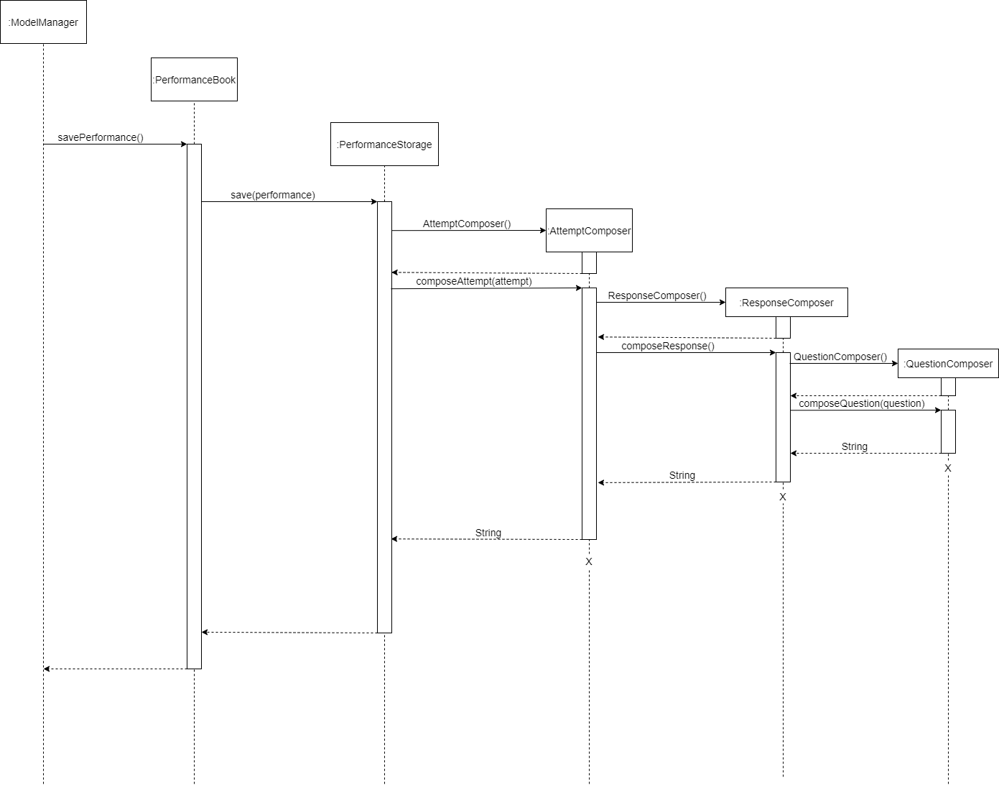

## **Implementation**

This section describes some noteworthy details on how certain features are implemented.

### Sort feature

The sort feature sorts the flashcards in the flashcard list in either ascending or descending order of priority. This feature is implemented
by creating an instance of `SortCommand` that can be executed on the model of the flashcard list. This particular implementation of the sort
feature was chosen because it accesses and modifies the internal flashcard list in the same way as other commands such as `ListCommand`, hence
preserving consistency in the program design.

The following sequence diagram shows how the sort feature works:

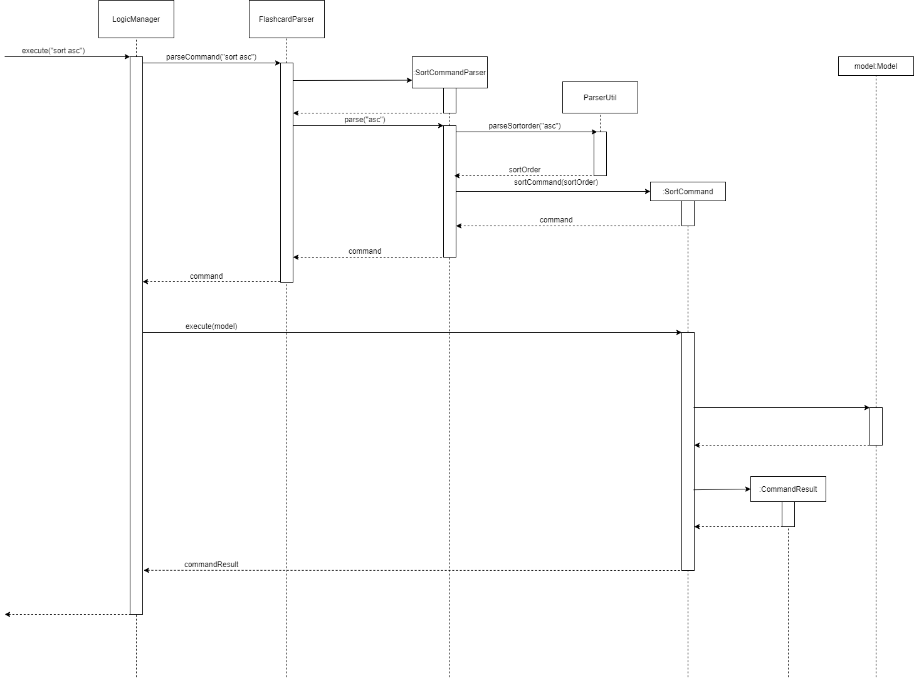

When the user executes a sort command, e.g. `sort asc`, `ParserUtil#parseSortOrder()` is called. This function trims whitespaces from the user
input and converts it to lowercase. Hence, user inputs that are in lowercase, uppercase, or both, e.g. `AsC`, are all valid. If the user does not
provide an argument, `asc` will be passed into the `SortCommand` object and the flashcard list will be sorted in ascending order of priority by
default.

The following activity diagram shows how user input is processed:

### Flip feature

The flip feature flips a flashcard to either show or hide its definition. This feature is implemented by creating an instance of a `FlipCommand` which
is then executed on the model of the flashcard list. This implementation was chosen because it preserves the original fields in a Flashcard such as the
definition. The command execution also works in a similar way to the other commands that were initially implemented.

The following class diagram describes the implementation of the flip feature:

The visible definition of a flashcard is toggled back and forth through a method in the `Flashcard` class through this command. The visible definition is
reflected in the user interface.

The following sequence diagram shows how the flip feature works:

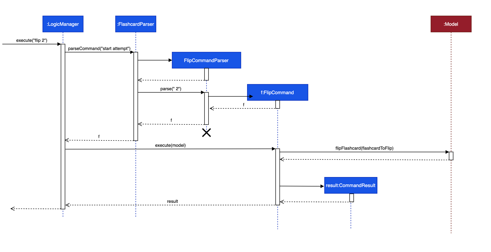

### [Proposed] Quiz feature

The proposed quiz feature defines a set of sample questions related to CS2040S, containing both MCQ and True-False
 questions, for users to test their knowledge of CS2040S content.

#### Implementation

The feature is facilitated by `QuizPaser`, `Performance`, `Attempt`, `Response` and `Question`.
`Performance` is a public class that keeps track of past attempts by storing `Attempt` as an internal
 `UniqueAttemptList`.
`Attempt` is a public class keeping track of user responses to a question by storing `Response` as an internal
 `UniqueResponseList`.
  Response is a public class with reference to the `Question` class.
  `Question` is an abstract class and `Mcq` and `TrueFalse` extends Question.

The following shows a Class Diagram of the structure of Quiz components:

`Performance` implements the following operations:

* `addAttempt(Attempt attempt)` - Records an attempt into performance.
* `getAttempts()` - Provides a list of past attempts.
* `getFormattedTimestamp(LocalDateTime timestamp)` - Returns a date and time in format yyyy/MM/dd HH:mm:ss.

`Attempt` implements the following operations:

* `addResponse(Response newResponse)` - Records user's new response into current attempt.
* `calculateScore()` - total score of attempt based on number of correct responses.
* `attemptAnalysis()` - Returns a detailed attempt analysis.
* `getResponses()` - Provides a list of responses in current attempt.

`Response` implements the following operations:

* `markResponse()` - Checks if answer of response is correct.

`Question` implements the following operations:

* `getQuestion()` — Provides both question description and options.
* `checkResponse(String response)` — Checks if the response is the same as the correct answer.
* `isMcq()` - Checks if question is Mcq or TrueFalse.
* `setSelectedIndex(int index)` - Sets user answer as selected option.

The general workflow of quiz feature is represented by the following Activity Diagram:
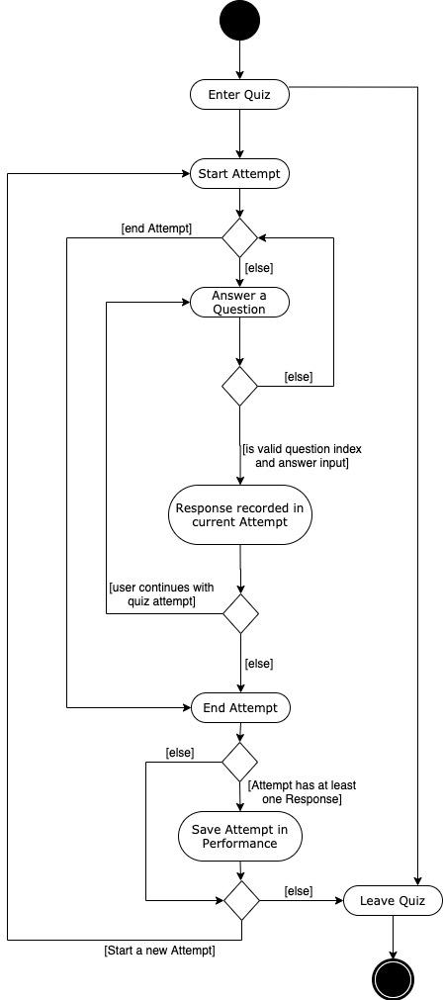

### Enter Quiz Feature
The `enter quiz` command switches interface from Flashcard mode to Quiz mode. This feature is implemented by creating an
instance of `EnterQuizCommand` that can be executed on the model. The `EnterQuizCommand` will return an instance of
`CommandResult` which will inform the `MainWindow` whether it is time to call `handleQuiz()` method to change to current UI.

The following shows a sequence diagram of enter quiz command.
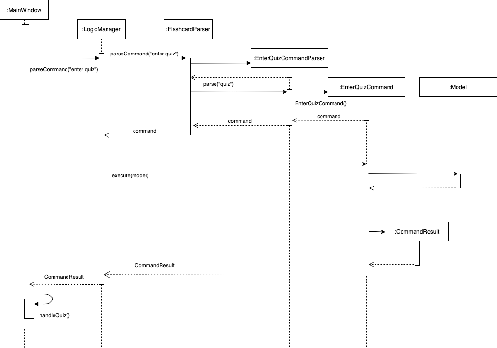

### Performance Feature

This activity diagram shows the possible user flow for a user who wants to check their past quiz records

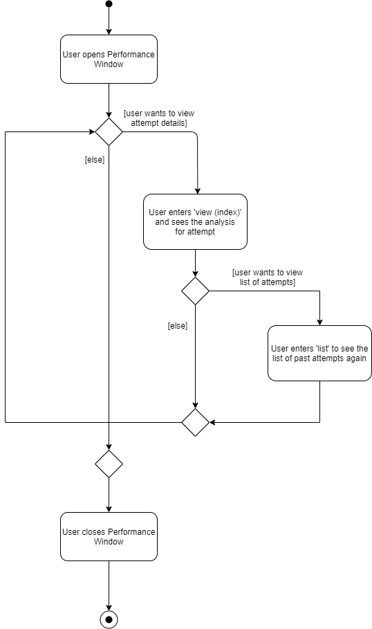

### View Attempt feature

The view attempt feature allows the user to view a past quiz record given by its index.
 This feature is implemented
by creating an instance of `ViewAttemptCommand` and returns a  `PerformanceCommand` which will trigger the a method in
Performance Window to display the responses accordingly

The following sequence diagram shows how the view attempt feature works:

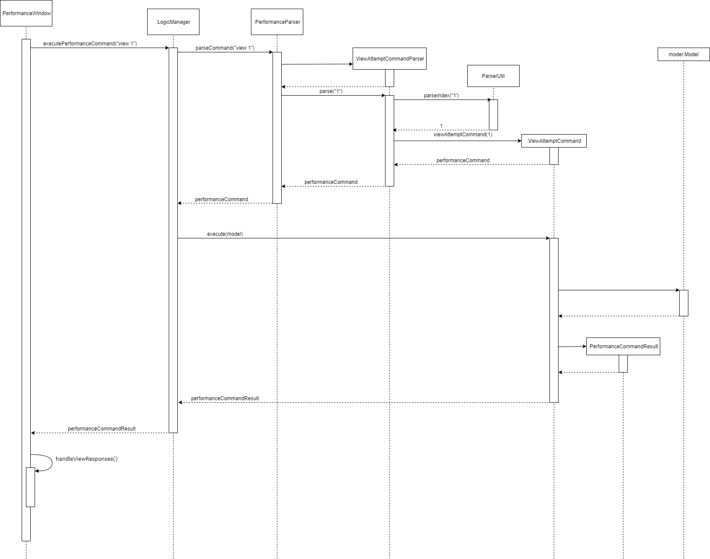

#### Design consideration:

##### Aspect: How undo & redo executes

* **Alternative 1 (current choice):** Saves the entire definition book.
  * Pros: Easy to implement.
  * Cons: May have performance issues in terms of memory usage.

* **Alternative 2:** Individual command knows how to undo/redo by
  itself.
  * Pros: Will use less memory (e.g. for `delete`, just save the flashcard being deleted).
  * Cons: We must ensure that the implementation of each individual command are correct.

### \[Proposed\] Data archiving

_{Explain here how the data archiving feature will be implemented}_

--------------------------------------------------------------------------------------------------------------------

## **Documentation, logging, testing, configuration, dev-ops**

* [Documentation guide](Documentation.md)
* [Testing guide](Testing.md)
* [Logging guide](Logging.md)
* [Configuration guide](Configuration.md)
* [DevOps guide](DevOps.md)

--------------------------------------------------------------------------------------------------------------------

## **Appendix: Requirements**

### Product scope

**Target user profile**:

* CS2040S students in NUS
* can type fast
* prefers typing to mouse interactions
* is reasonably comfortable using CLI apps
* wants a way to study 2040 concepts in a condensed format
* wants a way to use fragmented time for effective revision

**Value proposition**:
This product can help students with memory retention of various concepts and formulae in CS2040S. Students can utilize fragmented time to enhance learning.
This product can help with a quick review of concepts for students to check their understanding. Questions are neatly segmented into different topics for better organisation.
Concepts and definitions are organised according to different levels of priority for the student to allocate his studying time wisely.
Students can bookmark where they left off and resume going through the questions later.
Students can organise (specify the sequence) the flashcards as well.

### User stories

Priorities: High (must have) - `* * *`, Medium (nice to have) - `* *`, Low (unlikely to have) - `*`

| Priority | As a …​                                    | I want to …​                     | So that I can…​                                                      |
| -------- | ------------------------------------------ | ------------------------------ | ---------------------------------------------------------------------- |
| `* * *`  | new user                                   | view the user manual           | get a brief idea of how to use the app                                 |
| `* * *`  | user                                       | make new flashcards about the definition of a concept | remember my CS2040S content better              |
| `* * *`  | user                                       | delete a flashcard             | remove flashcards with mistakes or those I do not need                 |
| `* * *`  | user                                       | save the flashcards locally |  review some flashcards that I have previously made                       |
| `* *`    | user studying for a test                   | practice questions/ quizzes    | get good grades!                                                       |
| `* *`    | user studying for a test                   | review past quiz attempts      | so that I can learn from my mistakes                                   |
| `* *`    | user                                       | study pseudocode               | gain a better understanding of the algorithms                          |
| `* *`    | familiar user                              | search for flashcards using keywords |                                                                  |
| `* *`    | familiar user and visual learner           | insert diagrams in flashcards | remember the information better                                         |
| `* *`    | familiar user                              | delete wrong tags             |                                                                         |
| `* *`    | familiar user                            | label my flashcards   | sort them into different categories with appropriate tags.                        |
| `* *`    | familiar user                    | view flashcards according to the different topics   | study topic-by-topic.                                        |
| `* *`    | user with limited time              | I want to save my progress as I may not finish everything    | continue my revision from where I had left off from the previous session.  |
| `*`  | user who is familiar with the app			| set reminders indicating when I should study a particular flashcard | so that I can maximise information retention |
| `*`  | expert user								| use shortcuts                  | view my frequently-viewed flashcards more easily                             |
| `*`  | expert user                                | track my history of flashcards that I have viewed over the past specified time period(e.g week/month) | check my study habits regularly |
| `*`  | user who is familiar with the app           | favourite flashcards          | easily access flashcards I have to review more                               |
| `*`  | user studying for a test                   | design my own questions that I want to practice | be better prepared for exams                               |
| `*`  | expert user                                | check my history of my wrong quiz answers/ quiz scores | visualize my improvement in a statistical way      |
| `*`  | user studying for a test                   | add in T/F questions 			 | be better prepared for more types of questions                            |

### Use Cases
For all use cases below, `DSAce` is the **System** and the `User` is the **Actor**.

**Use case: Delete a flashcard**

**MSS**

1.  User requests to view the flashcard list.
2.  DSAce displays the entire flashcard list.
3.  User requests to delete a particular flashcard by specifying its index in the flashcard list.
4.  DSAce deletes the specified flashcard from the flashcard list and displays the updated flashcard list.  
    Use case ends.

**Extensions**

1a. The flashcard list is empty.  
1a1. DSAce does not display any flashcards.  
Use case ends.

3a. User specifies an invalid index.  
3a1. DSAce displays an error message.  
3a2. User specifies a new index.  
3a3. DSAce verifies the new index.  
Steps 3a2-3a3 are repeated until the specified index is valid.  
Use case resumes from step 4.

**Use case: Add a flashcard**

**MSS**

1. User requests to add a new flashcard by specifying attributes of the flashcard to be added.
2. DSAce creates the flashcard and adds it to the flashcard list. DSAce displays the updated flashcard list.  
Use case ends.

**Extensions**

1a. The new flashcard already exists in the flashcard list.  
1a1. DSAce displays an error message.  
1a2. User re-specifies the attributes of the flashcard to be added.  
1a3. DSAce verifies the new attributes.  
Steps 1a2-1a3 are repeated until the flashcard attributes specified does not coincide with that of an existing flashcard.  
Use case resumes from step 2.

**Use case: Edit a flashcard**

**MSS**

1. User requests to view the flashcard list.
2. DSAce displays the entire flashcard list.
3. User requests to edit a particular flashcard by specifying its index in the flashcard list, as well as the new
 attributes
of the flashcard to be edited.
4. DSAce edits the specified flashcard and displays the updated flashcard list.  
Use case ends.

**Extensions**

1a. The flashcard list is empty.  
1a1. DSAce does not display any flashcards.  
Use case ends.

3a. User specifies an invalid index.  
3a1. DSAce displays an error message.  
3a2. User specifies a new flashcard index.  
3a3. DSAce verifies the new index.  
Steps 3a2-3a3 are repeated until the specified index is valid.  
Use case resumes from step 4.

3b. The edited flashcard already exists in the flashcard list.  
3b1. DSAce displays an error message.  
3b2. User re-specifies the attributes of the flashcard to be edited.  
3b3. DSAce verifies the new attributes.  
Steps 3b2-3b3 are repeated until the edited flashcard does not coincide with any existing flashcard.  
Use case resumes from step 4.

**Use case: Take a quiz**

**MSS**

1. User requests to take a quiz.
2. DSAce displays the quiz interface.
3. User requests to begin a quiz attempt.
4. DSAce begins a new quiz attempt and indicates to the user that an attempt has started.
5. User inputs an answer for a specified question from the displayed question list.
6. DSAce records the result in the performance interface.  
Steps 5-6 are repeated until the user requests to end the current quiz attempt.
7. DSAce ends the current quiz attempt and indicates to the user that the current attempt has ended.  
8. User requests to end the quiz.  
9. DSAce displays the flashcard interface.  
Use case ends.

**Extensions**

1a. User is already in the quiz interface.  
1a1. DSAce displays an error message.  
Use case resumes from step 2.

3a. There is already an ongoing quiz attempt that has not ended yet.  
3b. DSAce displays an error message.  
Use case resumes from step 5.

5a. User specifies an invalid question index.  
5a1. DSAce displays an error message.  
5a2. User enters a new question index.  
5a3. DSAce verifies the new index.  
Steps 5a2-5a3 are repeated until the question index specified is valid.  
Use case resumes from step 6.

5b. User specifies an invalid answer to a specified question.  
5b1. DSAce displays an error message.  
5b2. User enters a new answer.  
5b3. DSAce verifies the new answer.  
Steps 5b2-5b3 are repeated until the answer specified is valid.  
Use case resumes from step 6.

6a. There is no ongoing quiz attempt to be concluded.  
6a1. DSAce displays an error message.  
Use case resumes from step 8.

6b. User ends the current quiz attempt without answering any questions.  
6b1. DSAce ends the current quiz attempt but does not save the results of the attempt in the performance interface.  
Use case resumes from step 8.

**Use case: view quiz performance**

**MSS**

1. User requests to view his/her quiz performance.
2. DSAce displays all the past quiz attempts in the performance interface.
3. User requests to view the results of a specific quiz attempt.
4. DSAce displays the results of the specified quiz attempt.
5. User requests to view the entire quiz attempt list.
6. DSAce displays the entire quiz attempt list.  
Use case ends.

**Use case: study flashcards**

**MSS**

1. User requests to view the flashcard list.
2. DSAce displays the entire flashcard list.
3. User requests to flip a particular flashcard by specifying its index in the flashcard list.
4. DSAce displays the entire flashcard list, with the specified flashcard being flipped.
5. User requests to sort the flashcard list by priority and specifies whether the order is ascending or descending.
6. DSAce displays the flashcard list that is sorted by priority, according to the order specified by the user.
7. User requests to find certain flashcard(s) by specifying attributes belonging to the flashcard(s) of interest.
8. DSAce displays the flashcards that user has requested for.  
Use case ends.

**Extensions**

1a. The flashcard list is empty.  
1a1. DSAce does not display any flashcards.  
Use case ends.

3a. The user specifies an invalid index.  
3a1. DSAce displays an error message.  
3a2. User specifies a new index.  
3a3. DSAce verifies the new index.  
Steps 3a2 to 3a3 are repeated until the index specified is correct.  
Use case resumes from step 4.

5a. The user does not specify whether the flashcard is to be sorted in ascending or descending order of priority.  
5a1. DSAce displays the flashcard list that is sorted in ascending order of priority.  
Use case resumes from step 7.

7a. There are no flashcards in the flashcard list that fulfill the user's specifications.  
7a1. DSAce does not display any flashcards.  
Use case ends.

### Non-Functional Requirements

* Should work on any *mainstream OS* as long as it has Java `11` or above installed.
* Should be able to store up to 1000 flashcards without a noticeable sluggishness in performance for typical usage.
* A user with above average typing speed for regular English text (i.e. not code, not system admin commands) should be able to accomplish most of the tasks faster using commands than using the mouse.
* Should not take up too much memory in the hard disk (i.e. the entire desktop application should not take up more than 100 MB of space).
* The system should work on both 32-bit and 64-bit environments.
* The flashcards would not be required to support inputs in formats other than utf-8.
### Glossary
* **Mainstream OS**: Windows, Linux, Unix, OS-X

--------------------------------------------------------------------------------------------------------------------

## **Appendix: Instructions for manual testing**

Given below are instructions to test the app manually.

:information_source: **Note:** These instructions only provide a starting point for testers to work on;
testers are expected to do more *exploratory* testing.

### Launch and shutdown

1. Initial launch

   1. Download the jar file and copy into an empty folder

   1. Double-click the jar file Expected: Shows the GUI with a set of sample contacts. The window size may not be optimum.

1. Saving window preferences

   1. Resize the window to an optimum size. Move the window to a different location. Close the window.

   1. Re-launch the app by double-clicking the jar file. 
       Expected: The most recent window size and location is retained.

### Deleting a flashcard

1. Deleting a flashcard while all flashcards are being shown

   1. Prerequisites: List all flashcards using the `list` command. Multiple flashcards in the list.

   1. Test case: `delete 1` 
      Expected: First contact is deleted from the list. Details of the deleted contact shown in the status message. Timestamp in the status bar is updated.

   1. Test case: `delete 0` 
      Expected: No flashcard is deleted. Error details shown in the status message. Status bar remains the same.

   1. Other incorrect delete commands to try: `delete`, `delete x`, `...` (where x is larger than the list size) 
      Expected: Similar to previous.

### Adding a flashcard

1. Adding a flashcard while all flashcards are being shown

   1. Test case: `add n/Testing d/Nothing p/High t/Sorting` 
      Expected: New flashcard with name `Testing`, definition `Nothing`, priority `high`, and tag `Sorting` is added to
      the bottom of the flashcard list. Details of the new flashcard are included in the status message.

   2. Test case: `add n/ d/sort slowly`
      Expected: No flashcard is added. Error details are shown in the status message.

### Editing a flashcard

1. Editing a flashcard while all flashcards are being shown

   1. Prerequisite: The flashcard list contains at least one flashcard. The first flashcard in the list does not have
    the name `Testing`.

   2. Test case: `edit 1 n/Testing` 
      Expected: The name of the first flashcard in the list is changed to `Testing`.

   3. Test case: `edit -1 d/Wrong flashcard` 
      Expected: No flashcard in the list is edited. Error details are shown in the status message.

### Finding a flashcard

1. Finding a flashcard while all flashcards are being shown

   1. Prerequisite: The flashcard list contains at least one flashcard. One of the flashcards has the name `Quicksort`.

   2. Test case: `find n/Quicksort`
      Expected: Only flashcards with the name `Quicksort` are displayed.

   3. Test case: `find`
      Expected: The find command is not executed. Error details are displayed in the status message.

### Starting a quiz attempt
1. Starting an attempt while user is in quiz mode and has no an ongoing attempt.

   1. Prerequisites: Switch to quiz mode from flashcard mode using the `enter quiz` command. Multiple questions are
    listed. No prior `start attempt` is called.

   1. Test case: `start attempt` 
      Expected: Attempt is started. Success message shown in the status message.

   1. Test case: `start` 
      Expected: No new attempt started. Error details shown in the status message. Status bar remains the same.

   1. Other incorrect end attempt commands to try: `start attempt 123`, `StArT AtTemPt` 
      Expected: Similar to previous.

1. Starts an attempt while user is in quiz mode and has an ongoing attempt.

   1. Prerequisites: Similar to previous prerequisites. Enter `start attempt` to start an ongoing attempt.

   1. Test case: `start attempt` 
      Expected: No new attempt started. Error details shown in the status message. Status bar remains the same.

### Ending a quiz attempt
1. Ending an attempt while user is in quiz mode and has an empty ongoing attempt.

   1. Prerequisites: Switch to quiz mode from flashcard mode using the `enter quiz` command. Multiple questions are listed. Enter `start
    attempt` to start an ongoing attempt.

   1. Test case: `end attempt` 
      Expected: Attempt ended but not saved in performance. Success message shown in the status message.

   1. Test case: `end` 
      Expected: Attempt does not end. Error details shown in the status message. Status bar remains the same.

   1. Other incorrect end attempt commands to try: `end attempt 123`, `EnD AtTemPt` 
      Expected: Similar to previous.

1. Ending an attempt while user is in quiz mode from flashcard mode and has a non-empty ongoing attempt.

   1. Prerequisites: Similar to previous prerequisites, enter `answer 1 a/true` to add a new response to current
    attempt.

   1. Test case: `end attempt` 
      Expected: Attempt ended and saved in performance. Success message shown in the status message.

### Answering a question

1. Answering a question while user is in quiz mode and has an ongoing attempt.

   1. Prerequisites: Switch to quiz mode from flashcard mode using the `enter quiz` command. Multiple questions are listed. Then start an
    attempt using `start attempt`.

   1. Test case: `answer 1 a/true` 
      Expected: Answer is recorded and user answer will be highlighted on the question. Success message shown in the
       status message.

   1. Test case: `answer 1` 
      Expected: No answer is recorded. Error details shown in the status message. Status bar remains the same.

   1. Test case: `answer 1 a/1` 
      Expected: Similar to previous.

   1. Other incorrect answer commands to try: `answer 1 a/random`, `answer 2 a/`, `answer 8 a/false`, `answer x
   `, `...` (where x is larger than the question list size) 
      Expected: Similar to previous.

### Sorting a flashcard

1. Sorting flashcards by priority while all flashcards are being shown

   1. Prerequisites: List all flashcards using the `list` command. Multiple flashcards in the list.

   1. Test case: `sort`
      Expected: Flashcards are sorted in order of ascending priority (when unspecified). Success message shown in status message. Timestamp in the status bar is updated.

   1. Test case: `sort asc` or `sort ASC` (case insensitive)
      Expected: Flashcards are sorted in order of ascending priority. Success message shown in status message. Timestamp in the status bar is updated.

   1. Test case: `sort desc` or `sort DESC` (case insensitive)  
      Expected: Flashcards are sorted in order of descending priority. Success message shown in status message. Timestamp in the status bar is updated.

   1. Other incorrect answer commands to try: `sort 123`, `sort ascending`, `sort descending`, `sort as`
   `, `...`  
      Expected: Error details shown in status message. Status bar remains the same

### Flipping a flashcard

1. Flipping flashcards by index while all flashcards are being shown

   1. Prerequisites: List all flashcards using the `list` command. Multiple flashcards in the list. The second flashcard has already been flipped (visible definition).

   1. Test case: `flip 1` 
      Expected: The definition of the first flashcard is now visible. Success message shown in status message. Timestamp in the status bar is updated.

   1. Test case: `flip 2` 
      Expected: The definition of the second flashcard is now hidden. Success message shown in status message. Timestamp in the status bar is updated.

   1. Test case: `flip 0` 
      Expected: No flashcard is flipped. Error details shown in the status message. Status bar remains the same.

   1. Other incorrect answer commands to try: `flip`, `flip one`, `flip x`, `...` (where x is larger than the list size) 
        Expected: Similar to previous.

### Saving data

1. Dealing with missing/corrupted data files

   1. `DSAce.json`, the JSON file used to store flashcard data, contains the data for at least one flashcard. Delete
    `"flashcards"` from the data for the first flashcard.
     Expected: No flashcards are displayed in the app.
