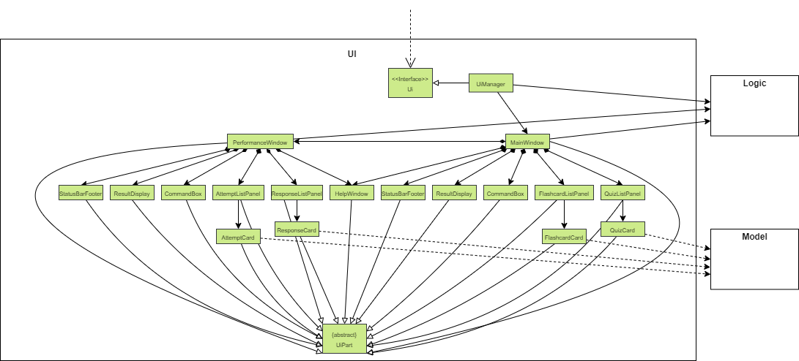
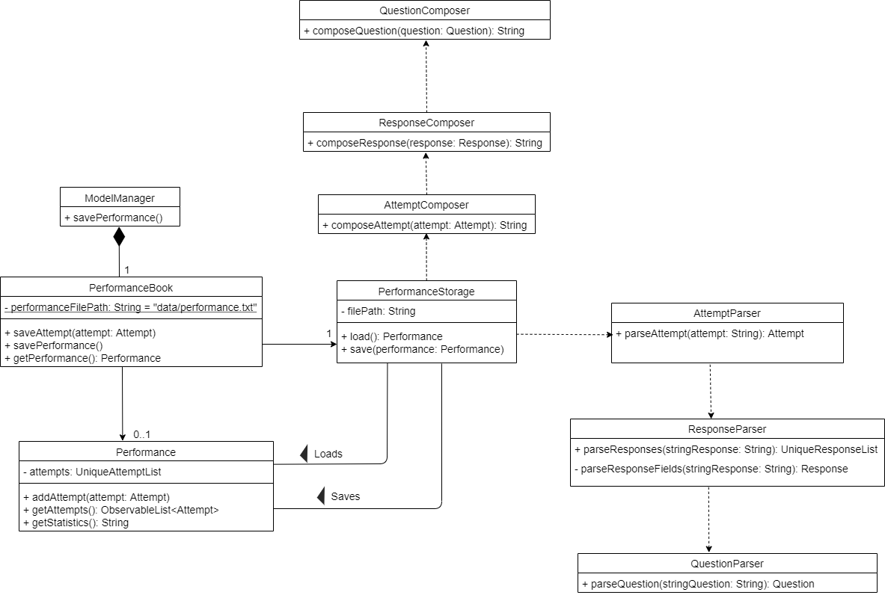
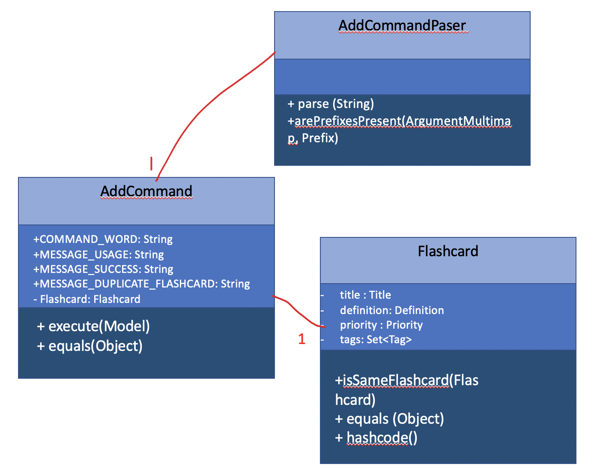
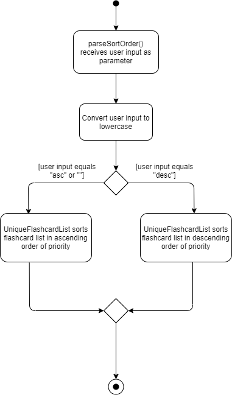
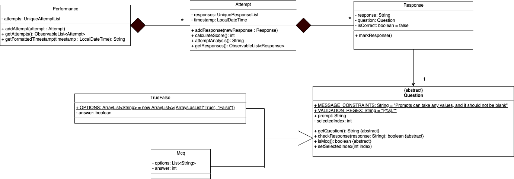
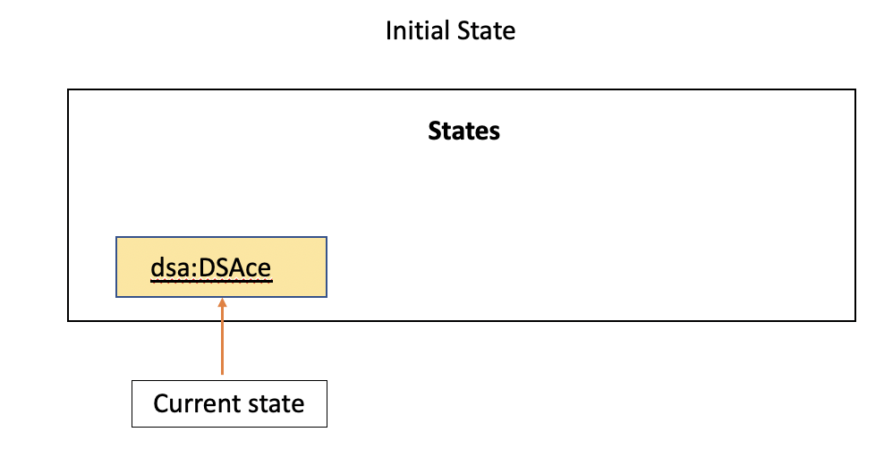
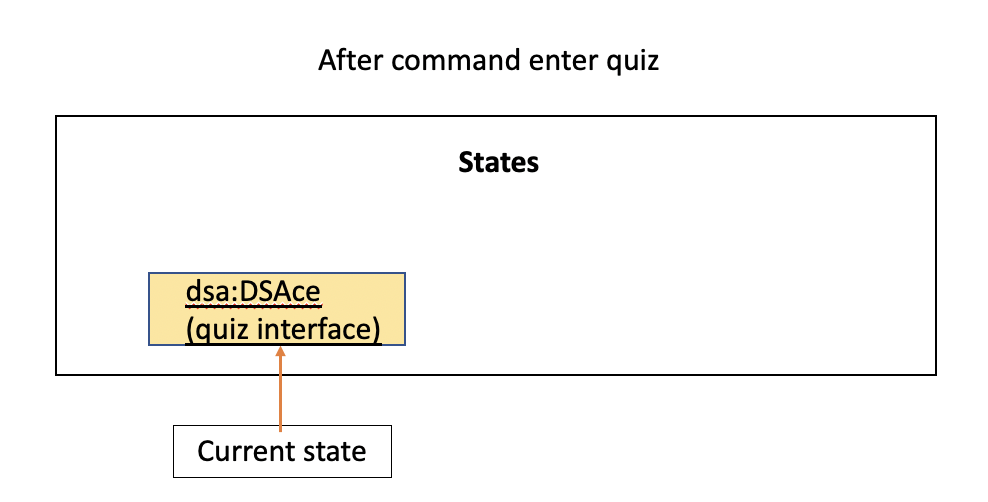
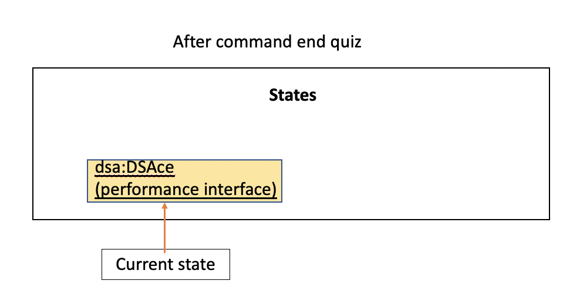
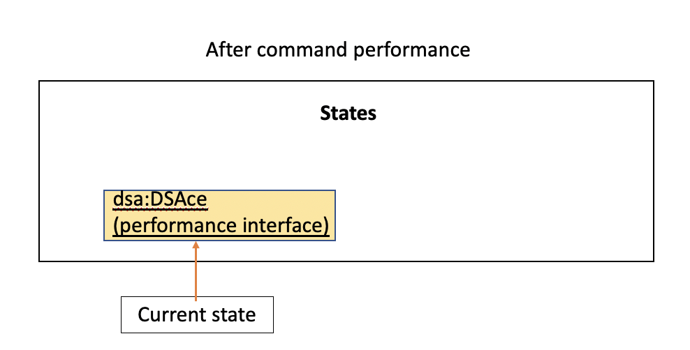
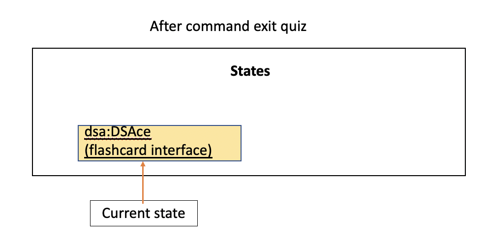

* Table of Contents
{:toc}

--------------------------------------------------------------------------------------------------------------------

## **Setting up, getting started**

Refer to the guide [_Setting up and getting started_](SettingUp.md).

--------------------------------------------------------------------------------------------------------------------

## **Design**

### Architecture

The ***Architecture Diagram*** given above explains the high-level design of the App. Given below is a quick overview of each component.

:bulb: **Tip:** The `.puml` files used to create diagrams in this document can be found in the [diagrams](https://github.com/se-edu/addressbook-level3/tree/master/docs/diagrams/) folder. Refer to the [_PlantUML Tutorial_ at se-edu/guides](https://se-education.org/guides/tutorials/plantUml.html) to learn how to create and edit diagrams.

**`Main`** has two classes called [`Main`](https://github.com/se-edu/addressbook-level3/tree/master/src/main/java/seedu/definition/Main.java) and [`MainApp`](https://github.com/se-edu/addressbook-level3/tree/master/src/main/java/seedu/definition/MainApp.java). It is responsible for,
* At app launch: Initializes the components in the correct sequence, and connects them up with each other.
* At shut down: Shuts down the components and invokes cleanup methods where necessary.

[**`Commons`**](#common-classes) represents a collection of classes used by multiple other components.

The rest of the App consists of four components.

* [**`UI`**](#ui-component): The UI of the App.
* [**`Logic`**](#logic-component): The command executor.
* [**`Model`**](#model-component): Holds the data of the App in memory.
* [**`Storage`**](#storage-component): Reads data from, and writes data to, the hard disk.

Each of the four components,

* defines its *API* in an `interface` with the same name as the Component.
* exposes its functionality using a concrete `{Component Name}Manager` class (which implements the corresponding API `interface` mentioned in the previous point.

For example, the `Logic` component (see the class diagram given below) defines its API in the `Logic.java` interface and exposes its functionality using the `LogicManager.java` class which implements the `Logic` interface.

**How the architecture components interact with each other**

The *Sequence Diagram* below shows how the components interact with each other for the scenario where the user issues the command `delete 1`.

The sections below give more details of each component.

### UI component

**API** :
[`Ui.java`](https://github.com/se-edu/addressbook-level3/tree/master/src/main/java/seedu/definition/ui/Ui.java)

The UI consists of a `MainWindow` that is made up of parts e.g.`CommandBox`, `ResultDisplay`, `PersonListPanel`, `StatusBarFooter` etc. All these, including the `MainWindow`, inherit from the abstract `UiPart` class.

The `UI` component uses JavaFx UI framework. The layout of these UI parts are defined in matching `.fxml` files that are in the `src/main/resources/view` folder. For example, the layout of the [`MainWindow`](https://github.com/se-edu/addressbook-level3/tree/master/src/main/java/seedu/definition/ui/MainWindow.java) is specified in [`MainWindow.fxml`](https://github.com/se-edu/addressbook-level3/tree/master/src/main/resources/view/MainWindow.fxml)

The `UI` component,

* Executes user commands using the `Logic` component.
* Listens for changes to `Model` data so that the UI can be updated with the modified data.

### Logic component

**API** :
[`Logic.java`](https://github.com/se-edu/addressbook-level3/tree/master/src/main/java/seedu/definition/logic/Logic.java)

1. `Logic` uses the `FlashcardParser`, `QuizParser` and `PerformanceParser` classes to parse the user command
 depending on which mode the app is in.
1. `FlashcardParser` and `QuizParser` will result in a `Command` object while `PerformanceParser` will result in a
 `PerformanceCommand` object.
1. Either `Command` or `PerformanceCommand` objects are executed by the `LogicManager`.
1. The command execution can affect the `Model` (e.g. adding a flashcard).
1. The result of the command execution is encapsulated as a `CommandResult` or `PerformanceCommandResult` object for
 which is passed back to the `Ui`.
1. In addition, the `CommandResult` or `PerformanceCommandResult` object can also instruct the `Ui` to perform
 certain actions, such as displaying help to the user.

Given below is the Sequence Diagram for interactions within the `Logic` component for the `execute("delete 1")` API call.

:information_source: **Note:** The lifeline for `DeleteCommandParser` should end at the destroy marker (X) but due to a limitation of PlantUML, the lifeline reaches the end of diagram.

### Model component

**API** : [`Model.java`](https://github.com/se-edu/addressbook-level3/tree/master/src/main/java/seedu/definition/model/Model.java)

The `Model`,

* stores a `UserPref` object that represents the user’s preferences.
* stores the definition book data.
* exposes an unmodifiable `ObservableList<Person>` that can be 'observed' e.g. the UI can be bound to this list so that the UI automatically updates when the data in the list change.
* does not depend on any of the other three components.

:information_source: **Note:** An alternative (arguably, a more OOP) model is given below. It has a `Tag` list in the `AddressBook`, which `Person` references. This allows `AddressBook` to only require one `Tag` object per unique `Tag`, instead of each `Person` needing their own `Tag` object. 

### Storage component

**API** : [`Storage.java`](https://github.com/se-edu/addressbook-level3/tree/master/src/main/java/seedu/definition/storage/Storage.java)

The `Storage` component,
* can save `UserPref` objects in json format and read it back.
* can save the flashcard book data in json format and read it back.

Additionally, the `Storage` component utilises a different mechanism for storing quiz performance data. The `Storage` component saves quiz performance data in text file format instead
of json format, and it reads it back using a separate set of classes. Hence, quiz performance data is stored and read separately from flashcard book data.

Within the `seedu.address.storage` package, there are several classes that are responsible for loading the performance of previous quiz attempts, and for saving the performance of current quiz attempts. The class diagram below
shows how these classes are related to one another.

Below are two sequence diagrams. The first sequence diagram shows the interactions between classes in the `seedu.address.storage` package when quiz performance data is read from
the text file and converted into a Performance object. The second sequence diagram shows the interactions between classes in the `seedu.address.storage` package when a Performance object
is converted to data that can be stored in the text file.

### Common classes

Classes used by multiple components are in the `seedu.addressbook.commons` package.
Example of class diagram for addCommandParser:

--------------------------------------------------------------------------------------------------------------------

## **Implementation**

This section describes some noteworthy details on how certain features are implemented.

### Sort feature

The sort feature sorts the flashcards in the flashcard list in either ascending or descending order of priority. This feature is implemented
by creating an instance of `SortCommand` that can be executed on the model of the flashcard list. This particular implementation of the sort
feature was chosen because it accesses and modifies the internal flashcard list in the same way as other commands such as `ListCommand`, hence
preserving consistency in the program design.

The following sequence diagram shows how the sort feature works:

When the user executes a sort command, e.g. `sort asc`, `ParserUtil#parseSortOrder()` is called. This function trims whitespaces from the user
input and converts it to lowercase. Hence, user inputs that are in lowercase, uppercase, or both, e.g. `AsC`, are all valid. If the user does not
provide an argument, `asc` will be passed into the `SortCommand` object and the flashcard list will be sorted in ascending order of priority by
default.

The following activity diagram shows how user input is processed:

### [Proposed] Quiz feature

The proposed quiz feature defines a set of sample questions related to CS2040S, containing both MCQ and True-False
 questions, for users to test their knowledge of CS2040S content.

#### Implementation

The feature is facilitated by `QuizPaser`, `Performance`, `Attempt`, `Response` and `Question`. 
`Performance` is a public class that keeps track of past attempts by storing `Attempt` as an internal
 `UniqueAttemptList`.
`Attempt` is a public class keeping track of user responses to a question by storing `Response` as an internal
 `UniqueResponseList`.
  Response is a public class with reference to the `Question` class.
  `Question` is an abstract class and `Mcq` and `TrueFalse` extends Question.

The following shows a Class Diagram of the structure of Quiz components:

`Performance` implements the following operations:

* `addAttempt(Attempt attempt)` - Records an attempt into performance.
* `getAttempts()` - Provides a list of past attempts.
* `getFormattedTimestamp(LocalDateTime timestamp)` - Returns a date and time in format yyyy/MM/dd HH:mm:ss. 

`Attempt` implements the following operations:

* `addResponse(Response newResponse)` - Records user's new response into current attempt.
* `calculateScore()` - total score of attempt based on number of correct responses.
* `attemptAnalysis()` - Returns a detailed attempt analysis.
* `getResponses()` - Provides a list of responses in current attempt.
 
`Response` implements the following operations:

* `markResponse()` - Checks if answer of response is correct.

`Question` implements the following operations:

* `getQuestion()` — Provides both question description and options.
* `checkResponse(String response)` — Checks if the response is the same as the correct answer.
* `isMcq()` - Checks if question is Mcq or TrueFalse.
* `setSelectedIndex(int index)` - Sets user answer as selected option.

These operations are exposed in the `Model` interface as `Model#startQuiz()`,`Model#enterQuiz()`,`Model#exitQuiz()` `Model#endQuiz()` and `Model#attemptQuestion()` respectively.

Given below is an example usage scenario and how to do quiz.

Step 1. The user launches the application and DSAce shows the default page with list of flashcards.

Step 2. The user executes `enter quiz` command to switch GUI interface. The `enter quiz` command calls `Model#enterQuiz()`, causing the change in interface and list of questions are displayed. The user can now answer questions with `attempt` command.

Step 3. The user finishes questions and executes `end quiz` command to end the current attempt, which will be stored. The result will be displayed.

Step 4. The user executes `past performance` during quiz mode to see past attempt performance. The list of past attempt is shown in sequence of time and number of correct answers.

Step 5. The user executes `exit quiz`, which calls `Model#exitQuiz`. The GUI interface is switch back to flashcard mode.

#### Design consideration:

##### Aspect: How undo & redo executes

* **Alternative 1 (current choice):** Saves the entire definition book.
  * Pros: Easy to implement.
  * Cons: May have performance issues in terms of memory usage.

* **Alternative 2:** Individual command knows how to undo/redo by
  itself.
  * Pros: Will use less memory (e.g. for `delete`, just save the flashcard being deleted).
  * Cons: We must ensure that the implementation of each individual command are correct.

_{more aspects and alternatives to be added}_

### \[Proposed\] Data archiving

_{Explain here how the data archiving feature will be implemented}_

--------------------------------------------------------------------------------------------------------------------

## **Documentation, logging, testing, configuration, dev-ops**

* [Documentation guide](Documentation.md)
* [Testing guide](Testing.md)
* [Logging guide](Logging.md)
* [Configuration guide](Configuration.md)
* [DevOps guide](DevOps.md)

--------------------------------------------------------------------------------------------------------------------

## **Appendix: Requirements**

### Product scope

**Target user profile**:

* CS2040S students in NUS
* can type fast
* prefers typing to mouse interactions
* is reasonably comfortable using CLI apps
* wants a way to study 2040 concepts in a condensed format
* wants a way to use fragmented time for effective revision

**Value proposition**:
This product can help students with memory retention of various concepts and formulae in CS2040S. Students can utilize fragmented time to enhance learning.
This product can help with a quick review of concepts for students to check their understanding. Questions are neatly segmented into different topics for better organisation.
Concepts and definitions are organised according to different levels of priority for the student to allocate his studying time wisely.
Students can bookmark where they left off and resume going through the questions later.
Students can organise (specify the sequence) the flashcards as well.

### User stories

Priorities: High (must have) - `* * *`, Medium (nice to have) - `* *`, Low (unlikely to have) - `*`

| Priority | As a …​                                    | I want to …​                     | So that I can…​                                                      |
| -------- | ------------------------------------------ | ------------------------------ | ---------------------------------------------------------------------- |
| `* * *`  | new user                                   | view the user manual           | get a brief idea of how to use the app                                 |
| `* * *`  | user                                       | make new flashcards about the definition of a concept | remember my CS2040S content better              |
| `* * *`  | user                                       | delete a flashcard             | remove flashcards with mistakes or those I do not need                 |
| `* * *`  | user                                       | save the flashcards locally |  review some flashcards that I have previously made                       |
| `* *`    | user studying for a test                   | practice questions/ quizzes    | get good grades!                                                       |
| `* *`    | user studying for a test                   | review past quiz attempts      | so that I can learn from my mistakes                                   |
| `* *`    | user                                       | study pseudocode               | gain a better understanding of the algorithms                          |
| `* *`    | familiar user                              | search for flashcards using keywords |                                                                  |
| `* *`    | familiar user and visual learner           | insert diagrams in flashcards | remember the information better                                         |
| `* *`    | familiar user                              | delete wrong tags             |                                                                         |
| `* *`    | familiar user                            | label my flashcards   | sort them into different categories with appropriate tags.                        |
| `* *`    | familiar user                    | view flashcards according to the different topics   | study topic-by-topic.                                        |
| `* *`    | user with limited time              | I want to save my progress as I may not finish everything    | continue my revision from where I had left off from the previous session.  |
| `*`  | user who is familiar with the app			| set reminders indicating when I should study a particular flashcard | so that I can maximise information retention |
| `*`  | expert user								| use shortcuts                  | view my frequently-viewed flashcards more easily                             |
| `*`  | expert user                                | track my history of flashcards that I have viewed over the past specified time period(e.g week/month) | check my study habits regularly |
| `*`  | user who is familiar with the app           | favourite flashcards          | easily access flashcards I have to review more                               |
| `*`  | user studying for a test                   | design my own questions that I want to practice | be better prepared for exams                               |
| `*`  | expert user                                | check my history of my wrong quiz answers/ quiz scores | visualize my improvement in a statistical way      |
| `*`  | user studying for a test                   | add in T/F questions 			 | be better prepared for more types of questions                            |

Use Cases
(For all use cases below, the **System** is the `DSAce` and the **Actor** is the `user`, unless specified otherwise)

**Use case: Delete a flashcard**

**MSS**

1.  User requests to list flashcards
2.  DSAce shows a list of flashcards
3.  User requests to delete a specific flashcard in the list
4.  DSAce deletes the flashcard

   Use case ends.

**Extensions**

* 2a. The list is empty.

 Use case ends.

* 3a. The given index is invalid.

  * 3a1. DSAce shows an error message.

     Use case resumes at step 2.

**Use case: Add a flashcard**

**MSS**

1.  User requests to add a flashcards
2.  DSAce adds the flashcard

   Use case ends.

**Extensions**

* 1a. The given input is invalid.

  * 1a1. DSAce shows an error message.

**Use case: Edit a flashcard**

**MSS**

1.  User requests to list flashcards to determine if the flashcard to be edited already exists
2.  DSAce shows a list of flashcards
3.  User requests to edit a specific flashcard in the list by providing the detail to be edited
4.  DSAce edits the flashcard

   Use case ends.

**Extensions**

* 2a. The list is empty.

 Use case ends.

* 3a. The given index is invalid.

  * 3a1. DSAce shows an error message.

     Use case resumes at step 2.

* 3b. The given input is invalid.

  * 3b1. DSAce shows an error message.

     Use case resumes at step 2.

**Use case: Take a quiz**

**MSS**

1.  User requests to see the list of quiz topics available for study
2.  DSAce shows a list of quiz topics
3.  User requests the topics to be covered in the quiz questions
4.  DSAce displays one question
5.  User inputs their answer for the displayed question
Use case loops through steps 4 and 5 until the quiz runs out of questions or the user inputs a stop command
6.  DSAce shows overall score and a list of questions with their marks
7.  User can request to view a particular question using the index
8.  DSAce displays the question, user’s answer and the correct answer
Use case loops through 7 and 8 upon user request until user inputs exit command

   Use case ends.

**Extensions**

* 2a. The list is empty.

 Use case ends.

* 3a. The user input topic index is invalid.

  * 3a1. DSAce shows an error message.

     Use case resumes at step 2.

* 5a. The user input answer is invalid.

  * 5b1. DSAce shows an error message.

     Use case resumes at step 4.

*{More to be added}*

### Non-Functional Requirements

* Should work on any *mainstream OS* as long as it has Java `11` or above installed.
* Should be able to store up to 1000 flashcards without a noticeable sluggishness in performance for typical usage.
* A user with above average typing speed for regular English text (i.e. not code, not system admin commands) should be able to accomplish most of the tasks faster using commands than using the mouse.
* Should not take up too much memory in the hard disk (i.e. the entire desktop application should not take up more than 100 MB of space).
* The system should work on both 32-bit and 64-bit environments.
* The flashcards would not be required to support inputs in formats other than utf-8.
### Glossary
* **Mainstream OS**: Windows, Linux, Unix, OS-X

--------------------------------------------------------------------------------------------------------------------

## **Appendix: Instructions for manual testing**

Given below are instructions to test the app manually.

:information_source: **Note:** These instructions only provide a starting point for testers to work on;
testers are expected to do more *exploratory* testing.

### Launch and shutdown

1. Initial launch

   1. Download the jar file and copy into an empty folder

   1. Double-click the jar file Expected: Shows the GUI with a set of sample contacts. The window size may not be optimum.

1. Saving window preferences

   1. Resize the window to an optimum size. Move the window to a different location. Close the window.

   1. Re-launch the app by double-clicking the jar file. 
       Expected: The most recent window size and location is retained.

1. _{ more test cases …​ }_

### Deleting a flashcard

1. Deleting a flashcard while all flashcards are being shown

   1. Prerequisites: List all flashcards using the `list` command. Multiple flashcards in the list.

   1. Test case: `delete 1` 
      Expected: First contact is deleted from the list. Details of the deleted contact shown in the status message. Timestamp in the status bar is updated.

   1. Test case: `delete 0` 
      Expected: No flashcard is deleted. Error details shown in the status message. Status bar remains the same.

   1. Other incorrect delete commands to try: `delete`, `delete x`, `...` (where x is larger than the list size) 
      Expected: Similar to previous.

1. _{ more test cases …​ }_

### Saving data

1. Dealing with missing/corrupted data files

   1. _{explain how to simulate a missing/corrupted file, and the expected behavior}_

1. _{ more test cases …​ }_
