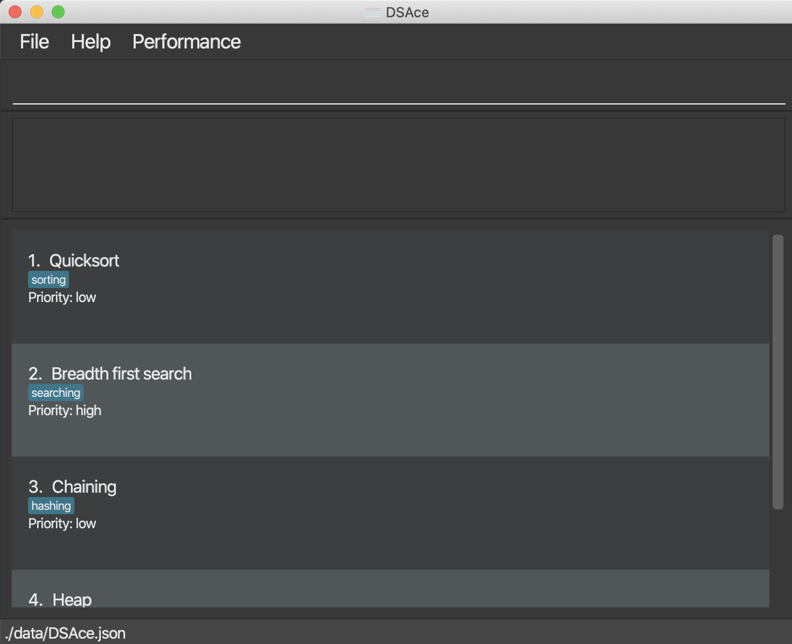
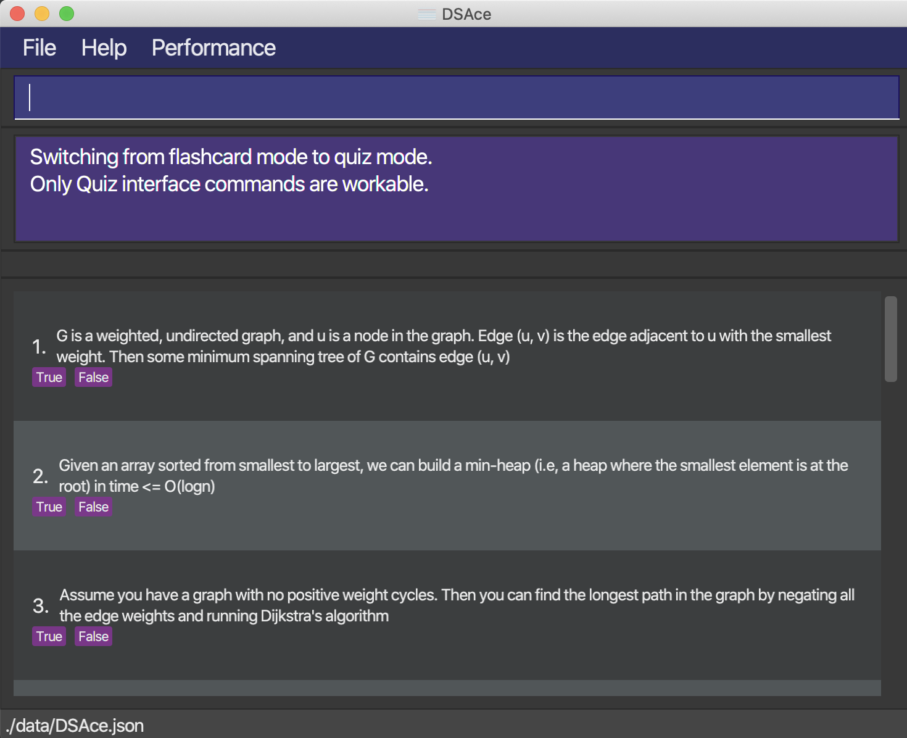
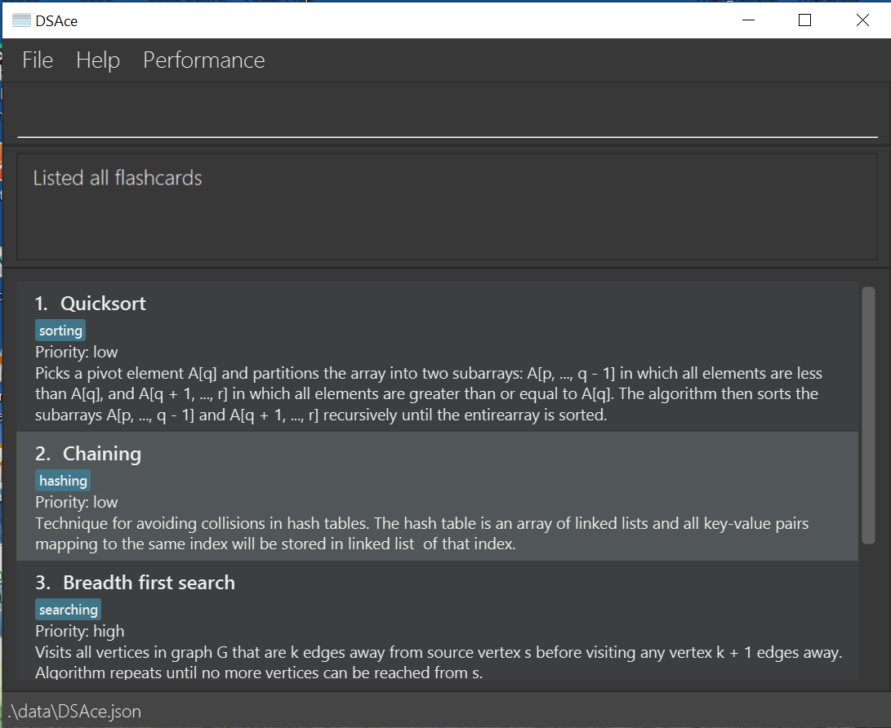
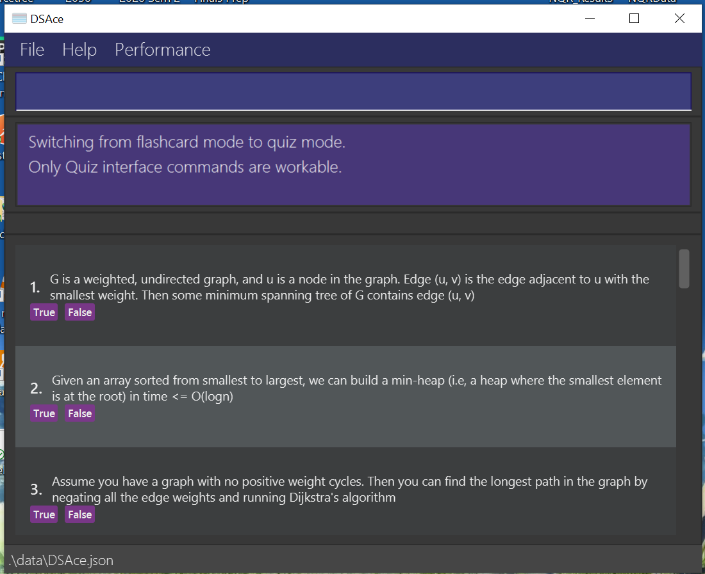
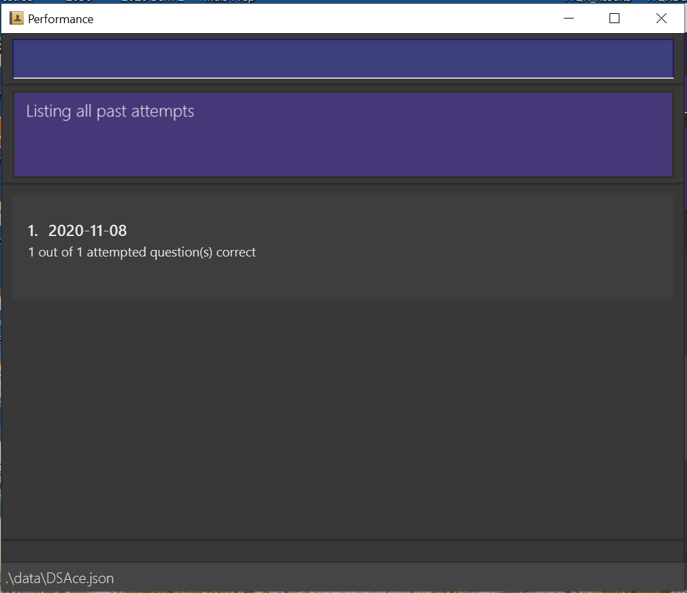
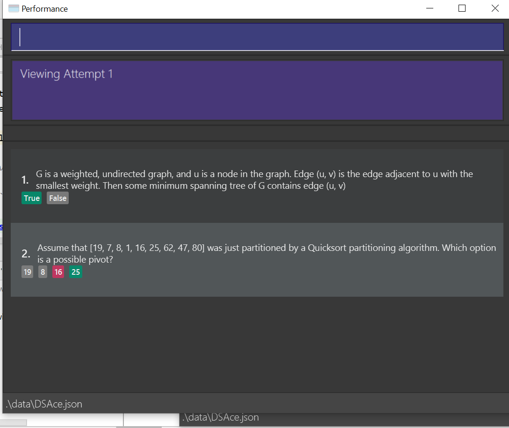
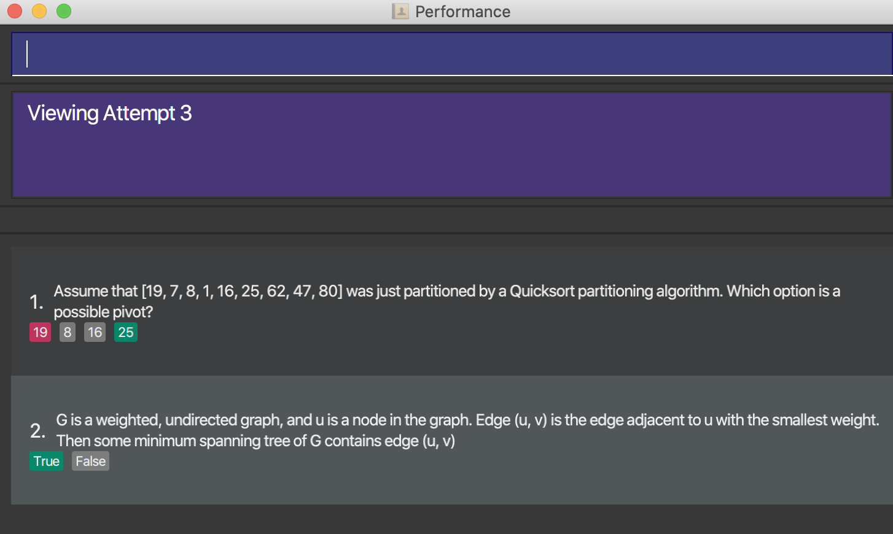

DSAce is a **desktop app for creating flashcards and practising quiz questions for CS2040s, optimized for use via a Command Line Interface** (CLI) while still having the benefits of a Graphical User Interface (GUI). If you can type fast, DSAce can get your revision done faster than traditional GUI apps.

## Table of Contents
* [Quick start](#quick-start)
* [Features](#features)
   * [General Commands](#general-commands)
      * [**`help`** : Viewing help.](#viewing-help--help)
      * [**`exit`** : Exiting the program.](#exiting-the-program--exit)
   * [Flashcard Commands](#flashcard-management)
      * [**`add`** : Adding a flashcard.](#adding-a-flashcard--add)
      * [**`list`** : Listing all flashcards.](#listing-all-flashcards--list)
      * [**`sort`** : Sorting all flashcards.](#sorting-all-flashcards--sort)
      * [**`edit`** : Editing a flashcard.](#editing-a-flashcard--edit)
      * [**`find`** : Locating flashcards by name/tag/priority.](#locating-flashcards-by-nametagpriority-find)
      * [**`flip`** : Flipping a flashcard.](#flipping-a-flashcard--flip)
      * [**`delete`** : Deleting a flashcard.](#deleting-a-flashcard--delete)
      * [**`clear`** : Clearing all flashcards.](#clearing-all-entries--clear)
   * [Quiz Commands](#quiz-commands)
      * [**`enter quiz`** : Entering Quiz mode.](#entering-quiz-mode--enter-quiz)
      * [**`start attempt`** : Starts a quiz attempt.](#entering-quiz-mode--start-attempt)
      * [**`answer`**: Answers a question in the quiz.](#entering-quiz-mode--answer)
      * [**`end attempt`** : Ends a quiz attempt.](#entering-quiz-mode--end-attempt)
      * [**`leave quiz`** : Leaving Quiz mode.](#leaving-quiz-mode--leave-quiz)
   * [Performance Commands](#performance-commands)
      * [**`performance`** : Opening performance interface.](#checking-performance--performance)
      * [**`view`** : Viewing previous an attempt result.](#viewing-a-specific-historical-attempt--view)
      * [**`list`** : List past quiz attempts.](#listing-historical-attempts-results--list)
   * [Saving the data.](#saving-the-data)
* [FAQ](#faq)
* [Command Summary](#command-summary)

--------------------------------------------------------------------------------------------------------------------

## Quick start

1. Ensure you have Java `11` or above installed in your Computer.

2. Download the latest `[CS2030-T14-2][DSAce].jar` from [here](https://github.com/AY2021S1-CS2103-T14-2/tp/releases).

3. Copy the file to the folder you want to use as the _home folder_ for the DSAce app.

4. Double-click the file to start the app. The GUI similar to the one below should appear in a few seconds. This GUI
 is the flashcard interface of the DSAce app.  

   

   **NOTE:** DSAce is used for storing flashcards that have a name, definition, tags, and priority level. Whenever the app is started up, the user will not be able to view the definitions of all the flashcards. This is
   so that the flashcards can be used as practice for remembering CS2040S definitions. Hence, in order to view or hide the definitions, the user must use the flashcard flip feature. To learn more about this
   feature, go to this [section](#flipping-a-flashcard--flip).

5. Type the command in the command box at the top of the interface and press Enter to execute it. e.g. typing **`help
`** and pressing Enter will open the help window. 
   Some example commands you can try:

   * **`list`** : Lists all flashcards.

   * **`add`**`n/Insertion Sort d/Worse case: O(n^2)` : Adds a flashcard with the name `Insertion Sort` and the
    definition `Worse case: O(n^2)` to the current list.

   * **`edit`**`1 n/BubbleSort d/Average case: O(n^2)` : Edits the name and definition of the first flashcard in the
   current list to be `BubbleSort` and `Average case: O(n^2)` respectively.

   * **`sort`**`desc` : Sorts all flashcards in descending order of priority.

   * **`find`**`n/Heap` : Finds all flashcards with names containing the keyword `Heap`.

   * **`delete`**`3` : Deletes the third flashcard shown in the current list.

   * **`flip`**`2` : Flips the second flashcard shown in the current list.

   * **`clear`** : Deletes all flashcards.

   * **`enter quiz`** : Enters Quiz mode.
   You should see a change in interface to quiz mode.
   

      * **`start attempt`** : Starts a new quiz attempt.

      * **`answer`** `1 a/true` : Answers the first quiz question in the displayed quiz question list.

      * **`end attempt`**: Ends the current quiz attempt.  
      
      `start attempt`, `answer`, and `end attempt` are commands that are valid only in the quiz interface.

   * **`leave quiz`** : Leaves Quiz mode.

   * **`performance`** : Enters the performance interface.

     * **`view`** `1` : Views the results of the first quiz attempt.

     * **`list`** : Lists all past quiz attempts.  
     
     `view` and `list` are the only valid commands in the performance interface.

   * **`exit`** : Exits the app.

6. Refer to subsequent sections for more details about each command.

7. All flashcards and data on past quiz attempts will be stored in the home folder. In particular, the flashcard data
 will be stored in a JSON file named `DSAce.json`, and data on past quiz attempts will be stored in a .txt file named
  `performance.txt`. Note that `performance.txt` is mean for data storage purposes only, so the data is not stored in
   a readable format.

--------------------------------------------------------------------------------------------------------------------

The DSAce app consists of three distinct interfaces. The first interface is the flashcard interface, where the user can access flashcard-related functionality.
An example of how the flashcard interface appears is shown in the image below.

The second interface is the quiz interface, where the user can attempt quiz questions. An example of how the quiz interface appears is
shown in the image below. Note that the quiz question list cannot be modified by the user i.e. the quiz questions are
 fixed.

The third interface is the performance interface, where the user can view the results of past quiz attempts. An example of how the performance interface appears
is shown in the image below. Note that the performance interface can be accessed using two different methods: firstly, by entering the `performance` command in the command box of either the flashcard or quiz interface, and secondly, by clicking on the `performance` option in the top menu bar of either the flashcard or quiz interface.

**:information_source: Notes about the command format:** 
* Listed below are three separate sets of commands for the flashcard, quiz, and performance interfaces. Unless explicitly stated, a command for a particular interface
  will not work in another interface.
   eg: add n/name d/definition cannot be used in the quiz and performance interfaces.  

* Words in `UPPER_CASE` are parameters that must be specified by the user.  
  e.g. in `add n/NAME`, `NAME` is a compulsory parameter.

* Parameters enclosed in square brackets are optional.  
  e.g. in `add n/NAME [t/HIGH]`, `HIGH` is an optional parameter.

* Parameters can be in any order.  
  e.g. if the command specifies `n/NAME d/DEFINITION`, `d/DEFINITION n/NAME` is also acceptable.

* Commands are case-sensitive unless stated otherwise. e.g. `Help` is not a valid command.

## General Commands

Only commands listed in this section are valid in the flashcard interface.

### Viewing help : `help`

Opens up a help window containing a link to the user guide.

Format: `help`

### Exiting the program : `exit`

Exits the program.

Format: `exit`

## Flashcard Commands

Only commands listed in this section are valid in the flashcard mode.

### Adding a flashcard : `add`

Adds a flashcard to the flashcard list.

Format: `add n/NAME d/DEFINITION [t/TAG] [p/PRIORITY]`

Examples:
* `add n/Bellman Ford Search d/runtime: O(VE) p/high`
* `add n/Bubble Sort d/runtime: O(n^2) t/sorting t/midterm`

Note:
- Names should only contain alphanumeric spaces and characters, and they should not be blank e.g. `n/breadth-first search` is not allowed.
- Multiple flashcards with the same name are not allowed e.g. `n/Quicksort` is not allowed if there already exists a
 flashcard with the name `Quicksort` in the flashcard list.
- If duplicate tags are specified, only one tag will be added e.g. if `t/sorting t/sorting` is specified, the flashcard will have only one tag with the label `sorting`.
- If multiple tags are added, `t/` must be specified for each and every tag e.g. `t/sorting t/midterm`
- If the priority is not specified, it will be low by default.
- For `name`, `definition`, and `priority`, if there are multiple arguments specified, the last argument will be taken e.g. if `n/Quicksort n/Slowsort d/sort quickly d/sort slowly p/low p/high` is specified,
  the flashcard will have name `Slowsort`, definition `sort slowly`, and priority `high`.

### Listing all flashcards : `list`

Shows a list of all flashcards.

Format: `list`

### Sorting all flashcards : `sort`

Sorts all flashcards in the flashcard list based on their priority level.

Format: `sort [ORDER]`

Note:
* `asc` is specified to sort the flashcards in ascending order of priority i.e. flashcards with `low` priority are displayed
   at the top of the list, and flashcards with `high` priority are displayed at the bottom.
* `desc` is specified to sort the flashcards in descending order of priority i.e. flashcards with `high` priority are displayed
   at the top of the list, and flashcards with `low` priority are displayed at the bottom.
* The order is case-insensitive. e.g `ASC` and `AsC` will both sort in ascending order of priority.
* If no order is specified, the default order is ascending.

Examples:
* `sort AsC` sorts all flashcards in ascending order of priority.
* `sort DEsc` sorts all flashcards in descending order of priority.

### Editing a flashcard : `edit`

Edits an existing flashcard in the flashcard list.

Format: `edit INDEX [n/NAME] [d/DEFINITION] [t/TAG] [p/PRIORITY]`

* Edits the flashcard at the specified `INDEX`.
* The index refers to the index number associated with the edited flashcard, as shown in the displayed flashcard list.
* The index **must be a positive integer** 1, 2, 3, …​
* At least one of the optional fields must be provided.
* Existing values will be updated to the input values.
* When editing tags, all existing tags of the specified flashcard will be removed, and only the edited tags will
 remain. e.g. when `edit 1 t/Sorting t/Optimal` is entered, the first flashcard in the flashcard list will only have
  tags `Sorting` and `Optimal`.
* You can remove all the tags of a specific flashcard by typing `t/` without specifying any tags after it.

Examples:
* `list` followed by `edit 1 n/BubbleSort d/Average case: O(n^2)` edits the name and definition of the first
 flashcard to
   be `BubbleSort` and `Average case: O(n^2)` respectively.
* `list` followed by `edit 2 n/SelectionSort t/` edits the name of the second flashcard to be `SelectionSort` and
 removes all of its existing tags.
* `list` followed by `edit 3 p/high` edits the priority of the third flashcard to be `high`.

Note:
- If multiple tags are edited, `t/` must be specified for each and every tag e.g `t/sorting t/midterm`
- For `name`, `definition`, and `priority`, if there are multiple arguments specified, the last argument will be taken
  e.g. if `edit 1 n/first n/second` is entered, the name of the first
   flashcard in the flashcard list will be `second`.

### Locating flashcards by name/tag/priority: `find`

Finds flashcards with names, tags or priorities containing any of the given keywords.

Format: find `[n/KEYWORD]​` `[t/KEYWORD]​` `[p/KEYWORD]​`

* All `find` operations are done on the original flashcards list which contains all flashcards.
* The search is case-insensitive. e.g `sort` will match `Sort`
* The order of the keywords does not matter. e.g. `runtime sort` will match `sort runtime`
* Names, tags or priorities will be searched according to input prefixes.
* Only full words will be matched e.g. `sort` will not match `sorting`
* Only flashcards matching all keywords will be returned (i.e. `AND` search).

Examples:

* `find n/Quicksort` returns `Quicksort`
* `find n/Chaining t/hashing` returns `Chaining`
* `find n/Heap p/medium` returns `Heaps`
* `find n/Heap p/low` or `find n/Chaining t/metal` returns no flashcards because not all conditions are satisfied

### Flipping a flashcard : `flip`

Flips the specified flashcard in the flashcard list. When the definition of a flashcard is hidden and `flip` is
 executed on that flashcard, the definition will be shown. Conversely, when the definition of a flashcard is
  displayed and `flip` is executed on that flashcard, the definition will be hidden.

Format: `flip INDEX`

* Flips the flashcard at the specified `INDEX`.
* The index refers to the index number associated with the flashcard to be flipped, as shown in the displayed flashcard
 list.
* The index **must be a positive integer** 1, 2, 3, …​
* The flashcard will not stay flipped when the user exits and re-enters the app.
* If the definition of a flashcard is shown and the user executes a command to edit it, the definition will remain
 displayed. Conversely, if the definition is hidden and it is edited by the user, it will remain hidden. However, the
  results of the `edit` command will be displayed as a message to the user.

Examples:
* `list` followed by `flip 2` flips the second flashcard in the flashcard list.

### Deleting a flashcard : `delete`

Deletes the specified flashcard from the flashcard list.

Format: `delete INDEX`

* Deletes the flashcard at the specified `INDEX`.
* The index refers to the index number associated with the deleted flashcard, as shown in the displayed flashcard list.
* The index **must be a positive integer** 1, 2, 3, …​

Examples:
* `list` followed by `delete 2` deletes the second flashcard in the list.

### Clearing all entries : `clear`

Removes all flashcards from the flashcard list.

Format: `clear`

## Quiz Commands

### Entering Quiz mode : `enter quiz`

Enters the quiz interface and disables commands from the flashcard interface.

Format: `enter quiz`

### Starting an attempt : `start attempt`

Starts a new quiz attempt.

Format: `start attempt`

### Answering a quiz question : `answer`

Answers the specified quiz question in the displayed quiz question list.

Format: `answer INDEX a/ANSWER`

* The index refers to the index number associated with the quiz question that the user intends to answer, as shown in
 the displayed quiz question list.
* The index **must be a positive integer** 1, 2, 3, …​
* For True/False questions, the answer must be either `true` or `false` (case-insensitive).
* For MCQ questions, the answer must be a positive integer corresponding to the option specified in the question.

Examples:
* To answer the first question which is a True/False question, enter either `answer 1 a/true` or `answer 1 a/false`
* To answer the second question which is a MCQ question, enter `answer 2 a/1` for option 1 or `answer 2 a/2` for
 option 2.

### Ending an attempt : `end attempt`

Ends the current quiz attempt and stores the results of the attempt in the performance interface.

Format: `end attempt`

* For `end attempt` to be a valid command, there must already be an ongoing quiz attempt.
* If `end attempt` is entered without answering any quiz questions, the current quiz attempt will end but no results
 will be stored in the performance interface.

### Leaving Quiz mode : `leave quiz`

Leaves the quiz interface and and disables all commands from the quiz interface.

Format: `leave quiz`

## Performance Commands

Only commands listed in this section are valid in the performance interface.
The performance interface is a separate window from the flashcard and quiz interfaces.

### Checking performance : `performance`

Opens the performance interface where the list of past quiz attempts are stored.

Format: `performance`

### Viewing the results of a specific quiz attempt : `view`

Displays the detailed results of a specific past quiz attempt. In the performance interface, a red option represents
an incorrect answer and a green option indicates a correct answer.

For example, in the image displayed below, the correct answer to the first question is `true`, and the first question
 was correctly answered by the user. On the other hand, the correct answer to the second question is 25, which is
  option `4`, but the user submitted an incorrect answer,  option `3`.
  
  
  
Format: `view INDEX`

Example: `view 1`

### Listing past attempt results: `list`

Shows a list of all past quiz attempts and the result statistic for each attempt. The result statistic consists of
 the number of correct responses out of the total number of responses submitted for each attempt.

Format: `list`

### Saving the data
DSAce data is saved in the home folder automatically after any command that changes the data is entered. There is no
 need to save the data manually.

### FAQ
Q: How do I transfer my data to another computer?  
A: Install the app in the other computer and overwrite the empty data file it creates with the file that contains the
 data from your previous DSAce home folder.

Q: How do I make my own quiz questions?  
A: CRUD quiz questions are part of our future plans.

Q: Why is there a need for both enter quiz and start attempt?  
A: This makes it easier to implement other quiz mode commands in the future (open for extension).

--------------------------------------------------------------------------------------------------------------------

## Command summary

Action | Format, Examples
--------|------------------
**Add** | `add n/NAME d/DEFINITION [t/TAG] [p/PRIORITY]`   e.g., `add n/Bellman-Ford Search d/runtime: O(VE)`
**Clear** | `clear`
**Sort** | `sort [ORDER]`   e.g., `sort ASC`
**Delete** | `delete INDEX`   e.g., `delete 3`
**Flip** | `flip INDEX`   e.g., `flip 2`
**Edit** | `edit INDEX [n/NAME] [d/DEFINITION] [t/TAGS] [p/PRIORITY]`   e.g., `edit 1 n/BubbleSort d/Average case: O(n^2) p/low`
**Find** | `find [n/KEYWORDS] [t/KEYWORD​S] [p/KEYWORD​S]​`   e.g., `find n/BellmanFord Search`
**List** | `list` (flashcard interface)
**Help** | `help`
**Exit** | `exit`
**Enter Quiz** | `enter quiz`
**Start attempt**  | `start attempt`
**Answer** | `answer INDEX a/ANSWER`   e.g., `answer 1 a/true` for True/False questions and `answer 2 a/1` for MCQ questions
**End attempt**  | `end attempt`
**Leave Quiz** | `leave quiz`
**Performance** | `performance`
**List** | `list` (performance interface)
**View** | `view INDEX`   e.g., `view 1`
